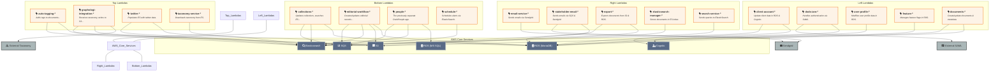

Drawing

```mermaid
graph TB
    %% --- 1. Define the Top Quadrant of Lambdas ---
    subgraph Top Lambdas
        direction LR
        L_auto["<div style='text-align:left; padding:5px;'><b>fa:fa-bolt-lightning auto-tagging-*</b><br><small><i>Adds tags to documents...</i></small></div>"]
        L_graph["<div style='text-align:left; padding:5px;'><b>fa:fa-bolt-lightning graphologi-integration-*</b><br><small><i>Receives taxonomy, writes to S3...</i></small></div>"]
        L_twitter["<div style='text-align:left; padding:5px;'><b>fa:fa-bolt-lightning twitter-*</b><br><small><i>Populates ES with twitter data.</i></small></div>"]
        L_tax["<div style='text-align:left; padding:5px;'><b>fa:fa-bolt-lightning taxonomy-service-*</b><br><small><i>Downloads taxonomy from ES.</i></small></div>"]
    end

    %% --- 2. Define the Central and Side Components ---
    subgraph Left Lambdas
        direction TB
        L_client["<div style='text-align:left; padding:5px;'><b>fa:fa-bolt-lightning client-account-*</b><br><small><i>Update client data in RDS & Cognito.</i></small></div>"]
        L_iam["<div style='text-align:left; padding:5px;'><b>fa:fa-bolt-lightning dods-iam-*</b><br><small><i>Handles authentication via SAML.</i></small></div>"]
        L_user["<div style='text-align:left; padding:5px;'><b>fa:fa-bolt-lightning user-profile-*</b><br><small><i>Modifies user profile data in RDS.</i></small></div>"]
        L_feature["<div style='text-align:left; padding:5px;'><b>fa:fa-bolt-lightning feature-*</b><br><small><i>Manages feature flags in RDS.</i></small></div>"]
        L_docs["<div style='text-align:left; padding:5px;'><b>fa:fa-bolt-lightning documents-*</b><br><small><i>Create/update documents & metadata.</i></small></div>"]
    end

    subgraph AWS Core Services
        direction TB
        S_s3["fa:fa-hard-drive S3"]
        S_es["fa:fa-magnifying-glass Elasticsearch"]
        S_rds_maria["fa:fa-database RDS (MariaDB)"]
        S_rds_ms["fa:fa-database RDS (MS SQL)"]
        S_cognito["fa:fa-user-lock Cognito"]
        S_sqs["fa:fa-list-check SQS"]
    end

    subgraph Right Lambdas
        direction TB
        L_email["<div style='text-align:left; padding:5px;'><b>fa:fa-bolt-lightning email-service-*</b><br><small><i>Sends emails via Sendgrid.</i></small></div>"]
        L_stake["<div style='text-align:left; padding:5px;'><b>fa:fa-bolt-lightning stakeholder-email-*</b><br><small><i>Sends emails via SQS & Sendgrid.</i></small></div>"]
        L_export["<div style='text-align:left; padding:5px;'><b>fa:fa-bolt-lightning export-*</b><br><small><i>Exports documents from S3 & RDS.</i></small></div>"]
        L_es_mgr["<div style='text-align:left; padding:5px;'><b>fa:fa-bolt-lightning elasticsearch-manager-*</b><br><small><i>Stores documents in ES index.</i></small></div>"]
        L_search["<div style='text-align:left; padding:5px;'><b>fa:fa-bolt-lightning search-service-*</b><br><small><i>Sends queries to ElasticSearch.</i></small></div>"]
    end

    %% --- 3. Define the Bottom Quadrant of Lambdas ---
    subgraph Bottom Lambdas
        direction LR
        L_coll["<div style='text-align:left; padding:5px;'><b>fa:fa-bolt-lightning collections-*</b><br><small><i>Updates collections, searches ES...</i></small></div>"]
        L_edit["<div style='text-align:left; padding:5px;'><b>fa:fa-bolt-lightning editorial-workflow-*</b><br><small><i>Creates/updates editorial records...</i></small></div>"]
        L_people["<div style='text-align:left; padding:5px;'><b>fa:fa-bolt-lightning people-*</b><br><small><i>The previously separate DodsPeople app.</i></small></div>"]
        L_sched["<div style='text-align:left; padding:5px;'><b>fa:fa-bolt-lightning schedule-*</b><br><small><i>Schedules alerts via ElasticSearch.</i></small></div>"]
    end
    
    %% --- 4. Define External Services (will be placed on the periphery) ---
    S_saml["fa:fa-id-card External SAML"]
    S_sendgrid["fa:fa-envelope Sendgrid"]
    S_taxonomy["fa:fa-sitemap External Taxonomy"]
    
    %% --- 5. Structural Links to enforce the Quadrant Layout ---
    %% This invisible link structure creates the radial effect.
    linkStyle default stroke-width:0px
    Top_Lambdas --- AWS_Core_Services --- Bottom_Lambdas
    Left_Lambdas --- AWS_Core_Services --- Right_Lambdas
    linkStyle default stroke-width:1px

    %% --- 6. Functional Links (Visible) ---
    L_auto --> S_s3; L_auto --> S_es
    L_client --> S_rds_maria; L_client --> S_cognito
    L_coll --> S_rds_maria; L_coll --> S_es; L_coll --> S_sqs
    L_docs --> S_rds_maria; L_docs --> S_s3
    L_iam --> S_cognito; L_iam --> S_saml
    L_edit --> S_rds_maria; L_edit --> S_s3; L_edit --> S_es; L_edit --> S_sqs
    L_es_mgr --> S_es
    L_email --> S_sendgrid
    L_export --> S_s3; L_export --> S_rds_maria
    L_feature --> S_rds_maria
    L_graph --> S_taxonomy; L_graph --> S_s3; L_graph --> S_es
    L_people --> S_rds_ms; L_people --> S_es; L_people --> S_sqs
    L_sched --> S_es
    L_search --> S_es
    L_stake --> S_sqs; L_stake --> S_sendgrid
    L_tax --> S_es
    L_twitter --> S_rds_maria; L_twitter --> S_es
    L_user --> S_rds_maria

    %% --- 7. Styling (abbreviated for clarity) ---
    classDef lambda fill:#FDF3E7,stroke:#F58536,stroke-width:2px;
    class L_auto,L_client,L_coll,L_docs,L_iam,L_edit,L_es_mgr,L_email,L_export,L_feature,L_graph,L_people,L_sched,L_search,L_stake,L_tax,L_twitter,L_user lambda;
    classDef aws_core fill:#5A6B86,stroke:#fff,stroke-width:1px,color:#fff;
    class S_s3,S_es,S_rds_maria,S_rds_ms,S_cognito,S_sqs aws_core;
    classDef external fill:#AAB7B8,stroke:#333,stroke-width:2px;
    class S_saml,S_sendgrid,S_taxonomy external;
```
